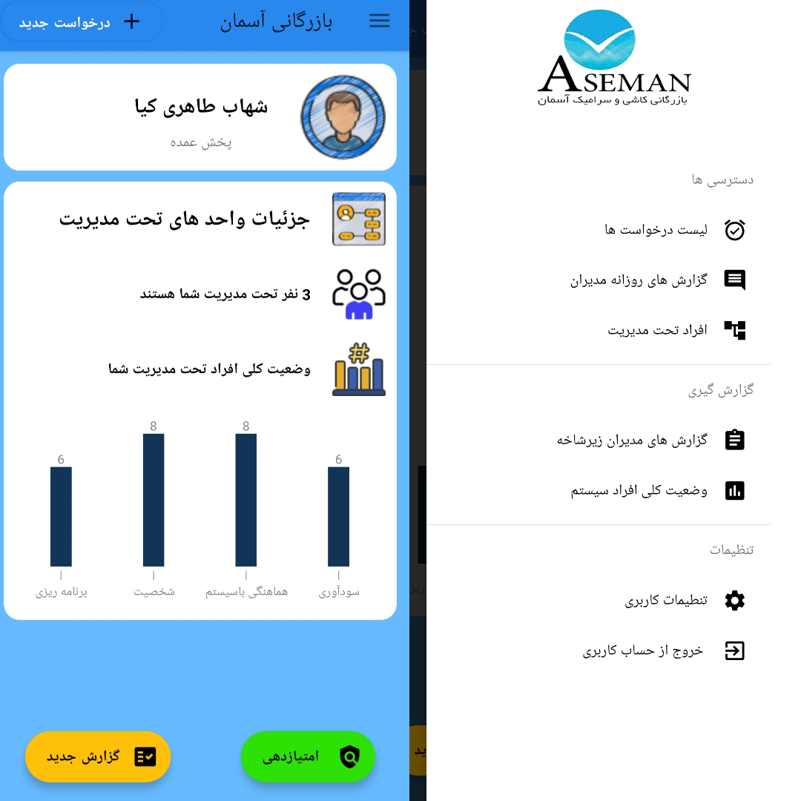
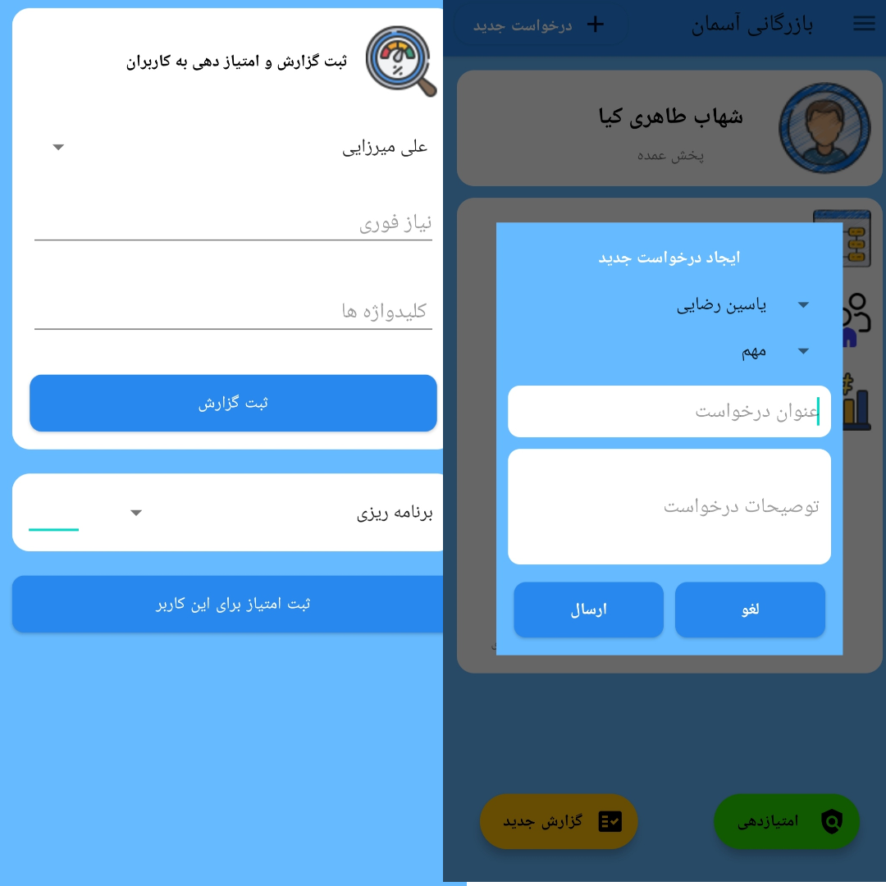

# `AsemanTile-HRM`
> This application was created internally for Aseman Company to evaluate the performance of its employees.

# `Uses`
> Each of the managers of this company can evaluate the performance of its sub-branches and send a report to the main manager of the system on a daily basis.

> Managers can assign the necessary activities to each other by registering tickets in the application.

# `Tools`
* Backend : Python - Django - DRF - MySql DB
* Android : Java

